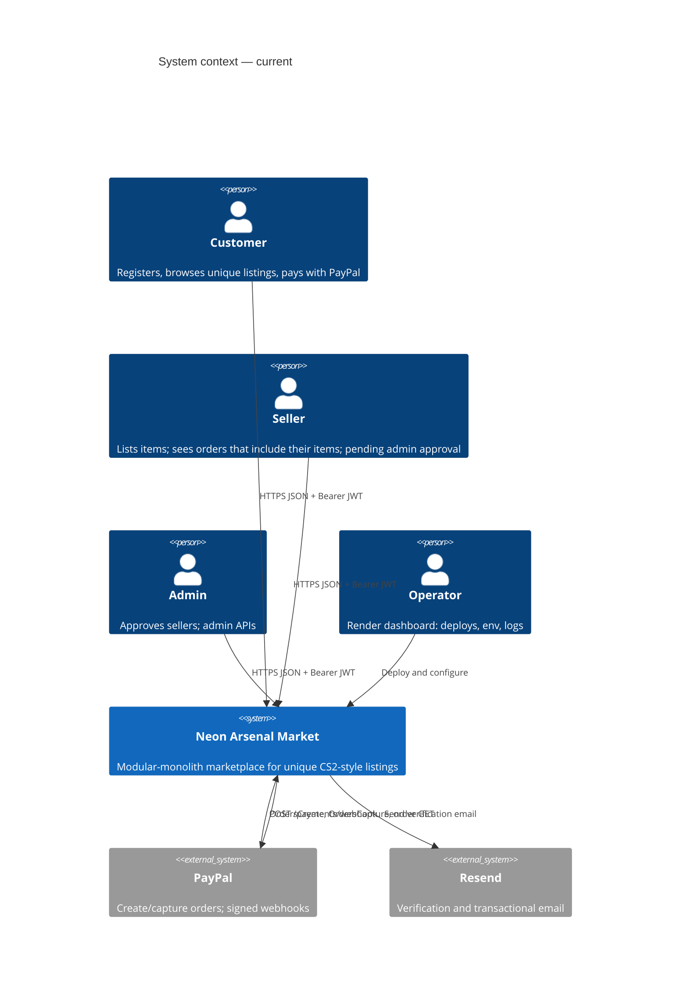
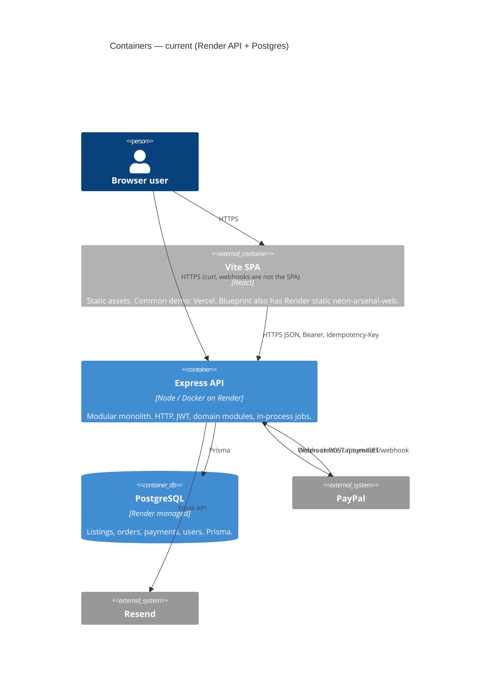
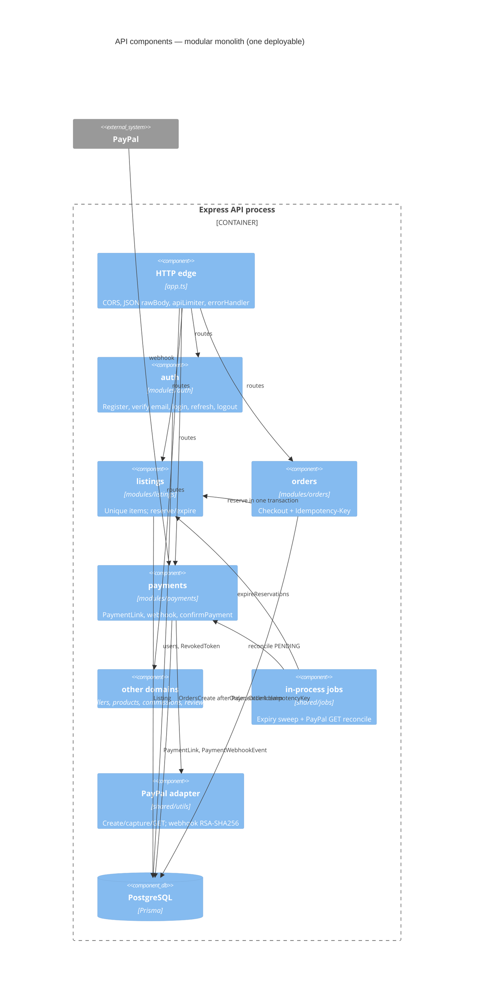

# C4 — Neon Arsenal Market

This is the **current** system, as deployed and as coded. It is not an AWS target-state drawing.

**Live production compute for the API is Render** (`render.yaml`): Docker web service `neon-arsenal-api` + managed PostgreSQL `neon-arsenal-db`. PayPal and Resend sit outside the process. There is **no** ECS/Fargate cluster, **no** ALB-as-live, **no** RDS, **no** Secrets Manager, **no** Terraform in this repository.

A **future** ECS/Fargate sketch exists on the P2 roadmap (`docs/roadmap.md`). That sketch is a portfolio option until activity **C1** writes an ADR. Do not read this file as if ECS were running.

**Related:** `docs/architecture/current-state.md`, `docs/operations/runbook.md`, `docs/architecture/threat-model.md`, `docs/architecture/scaling-path.md`.

---

## Level 1 — System context

People and external systems that talk to Neon Arsenal. The software system is one marketplace (Vite UI + Express API + PostgreSQL).

```text
                    ┌──────────────┐
                    │   Customer   │
                    └──────┬───────┘
                           │ HTTPS (browse, auth, checkout)
                           ▼
┌──────────┐        ┌─────────────────────┐        ┌──────────────┐
│  Seller  │───────►│  Neon Arsenal       │◄──────►│    PayPal    │
└──────────┘ HTTPS  │  Market             │ REST + │  (Orders,    │
                    │  (this repository)  │ webhook│   Capture,   │
┌──────────┐        │                     │        │   webhooks)  │
│  Admin   │───────►│                     │        └──────────────┘
└──────────┘ HTTPS  └──────────┬──────────┘
                               │ email
                               ▼
                        ┌──────────────┐
                        │    Resend    │
                        └──────────────┘
```



| Actor | Relationship |
|---|---|
| Customer / Seller / Admin | Browser calls the public API with JSON and `Authorization: Bearer`. Roles are JWT claims plus domain ownership checks. |
| Operator | Render (and optionally Vercel) dashboards. Not an application user. |
| PayPal | Unreliable external ledger. Local sale is PostgreSQL, not a client “paid” flag. |
| Resend | Email delivery. Not an authorization server. |

---

## Level 2 — Containers (what actually runs)

C4 “container” here means a **deployable / process**, not Docker-only.

### Current production topology

```text
Internet
  │
  ├─► Vite SPA  ── either Vercel (common split, vercel.json)
  │                 or Render static `neon-arsenal-web` (Blueprint)
  │                      │  API_URL (build-time / runtime config)
  │                      ▼
  └─► Render web service `neon-arsenal-api`
           Docker: server/Dockerfile
           bind 0.0.0.0:$PORT (Blueprint PORT=3001)
           healthCheckPath: /ready
           │
           ├─► Render Postgres `neon-arsenal-db`   (source of truth)
           ├─► PayPal REST + inbound webhook
           └─► Resend
```



| Container | Where it lives | Notes from the repo |
|---|---|---|
| Vite SPA | **Vercel** in the documented split (`vercel.json`, `README.md`); **or** Render static `neon-arsenal-web` in `render.yaml` | Not a security boundary. Needs `API_URL` pointing at the public API origin. SPA rewrite to `index.html`. |
| Express API | Render `neon-arsenal-api`, Docker, context `server/` | Entrypoint: migrate → optional seed → `node dist/index.js`. `GET /health` liveness (Docker HEALTHCHECK). `GET /ready` readiness (Render probe). |
| PostgreSQL | Render `neon-arsenal-db` | Authoritative business state. No Redis, no queue, no replica claimed as live. |
| PayPal | External | Sandbox in the Blueprint (`PAYPAL_MODE=sandbox`). Credentials `sync: false`. |
| Resend | External | `RESEND_API_KEY`, `EMAIL_FROM` `sync: false`. |

Secrets are **Render environment variables** (`JWT_*` `generateValue`; PayPal/Resend `sync: false`). That is not AWS Secrets Manager.

### What is inside the API process (not extra containers)

One Node process does HTTP **and** timers. Adding replicas duplicates those timers; they are written to be idempotent against PostgreSQL (`docs/architecture/scaling-path.md`).

| In-process job | Interval (as documented) | Role |
|---|---|---|
| Reservation expiry | 30s | Conditional `RESERVED → ACTIVE` when TTL elapsed; cannot overwrite `SOLD`. |
| PayPal GET reconciliation | 60s, min age 2 min, batch 20 | Recover capture if webhook was lost. Cannot sell an expired hold. |

OpenTelemetry is **optional** (`OTEL_ENABLED` defaults off). There is no sidecar collector in `render.yaml`.

### Not live (do not draw as current)

```text
Internet → ALB → ECS/Fargate → RDS → Secrets Manager → CloudWatch
```

That box is P2 **target-architecture prose** on the roadmap. It is **not** provisioned. C1 will decide whether it stays a diagram or becomes a migration.

Also not present as containers: Redis, Kafka, RabbitMQ, SQS, a separate worker service, API gateway product.

---

## Level 3 — Components (inside the Express API)

Preferred dependency direction (same as `current-state.md`):

```text
Routes / Controllers  →  Application / Domain services  →  Repositories  →  Prisma / PostgreSQL
```

Some services still call Prisma directly; that is a known inconsistency, not a second architecture.

```text
                         ┌─ requestId, CORS, JSON+rawBody, rate limit
 Incoming HTTP ──────────┤
                         └─ /health  /ready  /docs
                                    │
        ┌──────────┬──────────┬─────┴──────┬──────────┐
        │ auth     │ users    │ sellers    │ products │
        │ listings │ orders   │ payments   │ …        │
        │ reviews  │ admin    │ commissions│          │
        └──────────┴──────────┴────────────┴──────────┘
                                    │
                    shared: jwt, hash, paypal client,
                    webhook verify, errors, observability,
                    shutdown, jobs
                                    │
                              Prisma ──► PostgreSQL
```



| Component | Responsibility that matters for interviews |
|---|---|
| HTTP edge (`app.ts`) | Untrusted input. Captures `rawBody` for webhook signatures. Global in-memory rate limit. |
| auth | bcrypt passwords; Bearer access JWT; refresh `jti` denylist. ADMIN is not a public register role. |
| listings / orders | Unique listing: conditional `ACTIVE → RESERVED` in the same transaction as the order. |
| payments | Client cannot mark paid. `PaymentLink` before `OrdersCreate`. Webhook unsigned until verified. Only `PAYMENT.CAPTURE.COMPLETED` sells. |
| jobs | Same invariants as HTTP paths; they are not a second source of truth. |
| Prisma / PostgreSQL | Constraints (idempotency key, webhook event id, seller txn per order) enforce what the process might retry. |

---

## Trust and failure (C4 does not replace these)

- Trust boundaries and abuse controls: `docs/architecture/threat-model.md`.
- Crash, retry, webhook duplicate, capture-after-expiry: `docs/architecture/failure-modes.md` and `docs/operations/runbook.md`.
- Scaling: stay on this container diagram until a **measured** trigger in `docs/architecture/scaling-path.md`. Extra API replicas are more of the same container, not new services.

---

## How to use this in an interview

1. Draw **context** (people, PayPal, Resend).
2. Draw **containers** as Render API + Render Postgres + static SPA — say **ECS is not live**.
3. Zoom into **one process**: modules + in-process jobs + PostgreSQL constraints.
4. If asked “where is the queue?”, answer: there isn’t one; uniqueness and conditional updates are the coordination.
