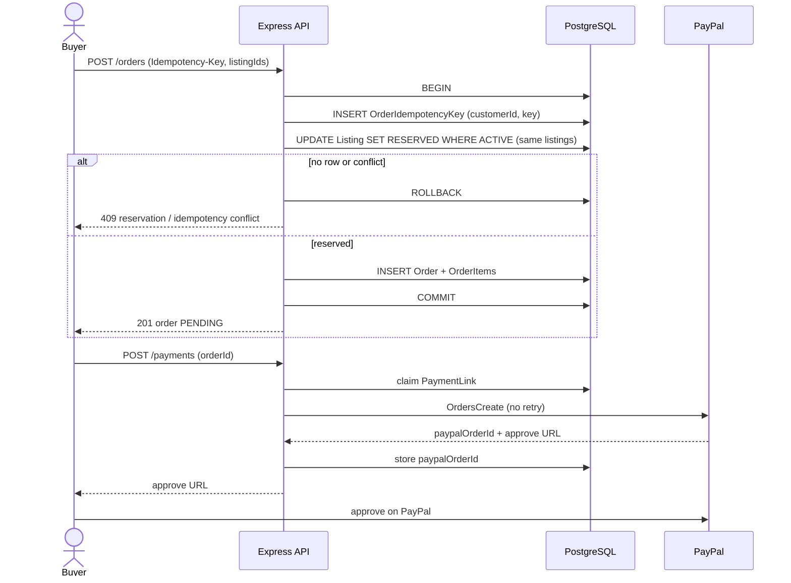

# Sequence diagrams

Issue #70. These match **current code**, not a target AWS architecture. There is no SQS, Redis, Kafka, or worker service (ADR 0018, ADR 0019). In-process timers are drawn as `Jobs` inside the same API process.

Architecture (C4): `docs/architecture/c4.md`. Invariants: `docs/architecture/current-state.md`.

## Checkout (order + payment link)

`POST /orders` reserves in one PostgreSQL transaction. PayPal `OrdersCreate` runs **after** a `PaymentLink` claim and **outside** that transaction. The client “paid” flag is not trusted.



## Concurrent reserve (same unique listing)

Only the conditional `ACTIVE → RESERVED` update wins. Two API replicas are the same protocol.

```mermaid
sequenceDiagram
  actor BuyerA
  actor BuyerB
  participant API as Express API (any replica)
  participant PG as PostgreSQL

  par same listing
    BuyerA->>API: POST /orders listing L
    BuyerB->>API: POST /orders listing L
  end
  API->>PG: UPDATE Listing L SET RESERVED WHERE status = ACTIVE
  Note over PG: one statement covers the row; the other updates 0 rows
  API-->>BuyerA: 201 order (winner)
  API-->>BuyerB: 409 reservation conflict
```

## Payment webhook

Unsigned until RSA-SHA256 verifies. Only `PAYMENT.CAPTURE.COMPLETED` sells. Duplicates are a unique `(provider, externalEventId)` no-op.

```mermaid
sequenceDiagram
  participant PP as PayPal
  participant API as Express API
  participant PG as PostgreSQL

  PP->>API: POST /payments/webhook (raw body)
  API->>API: verify RSA-SHA256 + transmission time ±5m
  alt bad signature or skew
    API-->>PP: 401 / 400
  else verified
    API->>PG: INSERT PaymentWebhookEvent (unique event id)
    alt duplicate PROCESSED or IGNORED
      API-->>PP: 200 no-op
    else PAYMENT.CAPTURE.COMPLETED
      API->>PG: confirmPayment TX (claim order, sell hold, ledger, outbox)
      alt hold expired or not this order
        API->>PG: do not SOLD; HTTP 200 (PayPal stops retry)
      else sold
        API-->>PP: 200
      end
    else CHECKOUT.ORDER.APPROVED
      API->>PG: mark IGNORED
      API-->>PP: 200
    end
  end
```

Capture on the return page (`POST /payments/capture`) and GET reconciliation of a live `APPROVED` hold call `OrdersCapture` once, then the same `confirmPayment`.

## Reconciliation (PayPal GET + in-process jobs)

Lost webhooks are recovered by an in-process sweep (60s, min age 2 minutes, batch 20). This is not a queue consumer.

```mermaid
sequenceDiagram
  participant Jobs as API process timers
  participant PG as PostgreSQL
  participant PP as PayPal

  loop every 60s (unref interval)
    Jobs->>PG: stale PENDING orders with paypalOrderId (batch 20)
    Jobs->>PP: OrdersGet (retry 5xx/429 only)
    alt COMPLETED
      Jobs->>PG: confirmPayment (same TX as webhook)
    else APPROVED and hold still live
      Jobs->>PP: OrdersCapture once (no retry)
      Jobs->>PG: confirmPayment
    else hold expired
      Note over Jobs,PG: do not SOLD (same as webhook)
    end
  end

  loop every 30s
    Jobs->>PG: RESERVED and reservationExpiresAt <= now → ACTIVE
    Jobs->>PG: cancel unpaid orders that no longer hold listings
  end

  loop seller ledger 60s
    Jobs->>PG: SET Seller.balance = SUM(PAID netAmount) if drifted
  end

  loop outbox (skip locked)
    Jobs->>PG: claim OutboxEvent; log + metric; mark PUBLISHED
  end
```

## What not to draw

- SQS / SNS / Kafka / RabbitMQ
- A second worker container
- Redis
- ALB → ECS → RDS as **current** (ADR 0007: Render is live)
